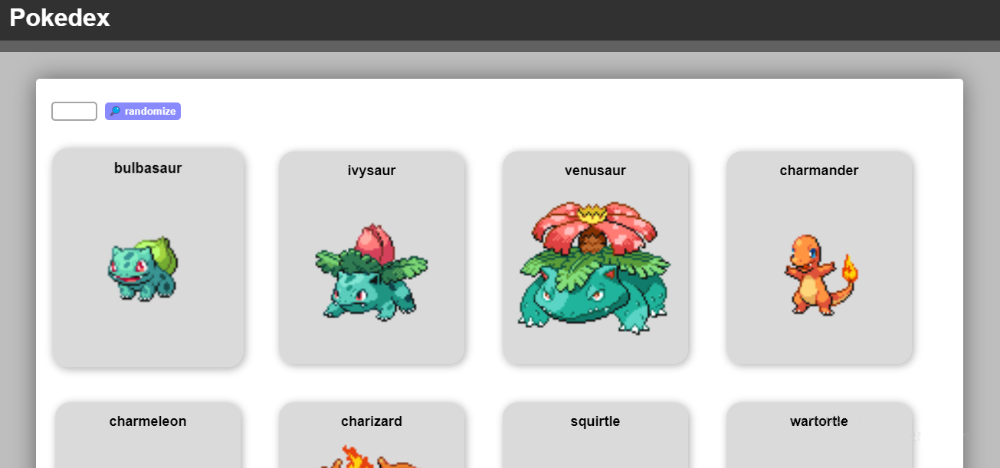

<h1  align="center"> Pokedex </h1>

Projeto de integração com a popular API de Pokemons, PokeAPI.

 
<a href="#-tecnologias-utilizadas">Tecnologias</a>&nbsp;&nbsp;&nbsp;|&nbsp;&nbsp;&nbsp;
<a href="#-como-acessar-o-projeto">Como acessar</a>&nbsp;&nbsp;&nbsp;|&nbsp;&nbsp;&nbsp;
 <a href="#%EF%B8%8F-licença">Licença</a>

  

---
&nbsp;
## 🚀 Tecnologias utilizadas
Esse projeto foi desenvolvido utilizando as seguintes tecnologias:

- HTML e CSS
- Javascript
- Git e Github

&nbsp;
## 💻 Como acessar o projeto
Para rodar o projeto localmente no seu computador, as etapas a seguir devem ser seguidas:

1. O projeto se encontra hospedado na internet, você pode acessá-lo apertando [AQUI](http://pokedex-azzypog.vercel.app) ou pelo **link** fixado no [topo](#-pokedex-) deste repositório.

&nbsp;
## 🖊️ Licença
Este projeto está sob a Licença MIT. Veja o arquivo [LICENSE](LICENSE) para mais detalhes.

---
**Projeto feito por Renato Longo Filho. Qualquer dúvida ou informações, Entre em contato pelo e-mail renato.longo1406@gmail.com**
